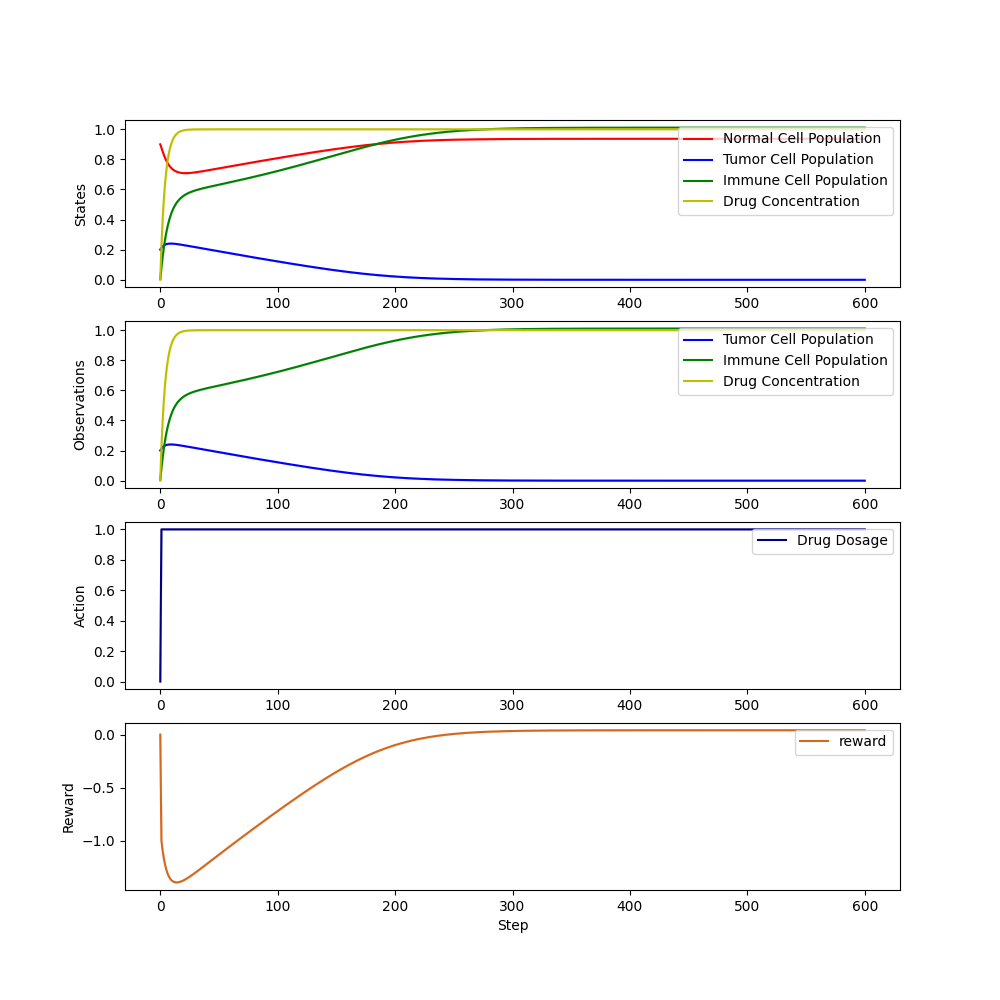

<h3 align="center">DTR-Bench</h3>

<div align="center">

  []() 
  [](https://github.com/GilesLuo/SimMedEnv/issues)
  [](https://github.com/GilesLuo/SimMedEnv/pulls)
  [](/LICENSE)

</div>

---

<p align="center"> An in silico Environment and Benchmark Platform for Reinforcement Learning Based Dynamic Treatment Regime
    <br> 
</p>

## 📝 Table of Contents
- [About](#about)
- [Getting Started](#getting_started)
- [Module Description](#module_description)
- [Usage](#usage)
- [Reference](#reference)
- [Special Thanks](#special_thanks)
- [Acknowledge](#ccknowledgement)

## 🧐 About <a name = "about"></a>
DTR-Bench (DTR-Bench) is an expanding reinforcement learning simulation platform with a unified pipeline including hyperparameter search, training, evaluation, and visualisation.
## 🏁 Getting Started <a name = "getting_started"></a>
These instructions will get you a copy of the project up and running on your local machine.

### Prerequisites
+ Python 3.10: The project is developed using Python 3.10. It is recommended to use the same version to avoid compatibility issues.

### Installing
1. Install the DTR-Gym and the DTR-Bench
```
pip install dtrgym
```
2. Install the required packages
```
cd SimMedEnv
pip install -r requirements.txt
```

3. Test the installation
```
python test_installation.py
```

### Running the getting started demo
We provide a simple example to show how to use the DTR-Bench. The example is in the *get_start.py* file.

You can run the example by:
```
python get_start.py
```

After running the example, you will see the following a plot like this. It shows the effect of the treatment given by the train RL policy in the simulation environment.



## 🎈 Module Description <a name="module_description"></a>

### Offpolicy RL Algorithms
The DTRBench provides a set of off-policy RL algorithms to train the RL policy in the simulation environments. These policies are developed based on [Tianshou](https://github.com/thu-ml/tianshou). The off-policy RL algorithms include:

| Discrete       | RNN-based       | Continuous |
|----------------|-----------------|------------|
| DDQN           | DQN-rnn         | DDPG       |
| DDQN-dueling   | DDQN-rnn        | TD3        |
| DQN            | C51-rnn         | SAC        |
| C51            | discrete-SAC-rnn|            |
| discrete-SAC   |                 |            |

### Run RL Functions
Running functions in reinforcement learning, which includes hyperparameters grid-searching, policies training and evaluation, and baseline policies evaluation.


### Visualisation
The DTRBench provides a [standard visualisation tool](DTRBench/visual_fn/env_vis_fn.py) to visualise the treatment effect of the trained RL policy in the simulation environments. It enables visualising the environment states, observations, actions, and the reward.


## 🔧 Usage <a name = "usage"></a>
The DTR-Bench provides a set of APIs to interact with the simulation environments and the benchmark policies.

It can be used to:
1. Create a simulation environment.
2. Optimize the hyperparameters of the RL policy training.
3. Train a RL policy in the simulation environments.
4. Visualize the treatment effect of the trained RL policy.

### Create a Simulation Environment
```python
import gymnasium as gym
import DTRGym  # this line is necessary!

gym.make('AhnChemoEnv-discrete', n_act=11)
```
Please remember to import [DTRGym](DTRGym/__init__.py) to register the simulation environments.

### Hyperparameters Search
1. Discrete policies
todo: change the cd path
```
cd SimMedEnv
export PYTHONPATH="."

python DTRBench/run_rl/online_discrete_search.py --policy_name=DQN --task SimGlucoseEnv --n_trials 100 --num_actions 11 --setting 1
```
2. continuous policies
```
cd SimMedEnv
export PYTHONPATH="."

python DTRBench/run_rl/online_continuous_search.py --policy_name=DDPG --task OberstSepsisEnv --n_trials 100 --setting 1
```

### Online Training and Testing
1. Discrete Policies
```
cd SimMedEnv
export PYTHONPATH="."
conda activate torch

python DTRBench/run_rl/online_discrete_retrain.py --policy_name=DQN --task SimGlucoseEnv --num_actions 11 --setting 1
````

2. Continuous Policies
```
cd SimMedEnv
export PYTHONPATH="."
conda activate torch

python DTRBench/run_rl/online_continuous_retrain.py --policy_name=DDPG --task SimGlucoseEnv --setting 1
```

3. Baseline Policies (RandomPolicy, MaxPolicy, MinPolicy)
```
cd SimMedEnv
export PYTHONPATH="."
conda activate torch

python DTRBench/run_rl/online_baseline.py --task OberstSepsisEnv
```

### Visualisation
```
cd SimMedEnv
export PYTHONPATH="."

python DTRBench/visual_fn/visual.py
```

### Download the Hyperparameters and Test Results
The hyperparameters and test results are stored on [Kaggle](https://www.kaggle.com/datasets/mingchengzhu/dtr-bench-hyperparameters-and-test-results).

## Reference <a name = "reference"></a>
If you use the DTR-Bench in your research, please cite the following paper:
```
to be updated
```

## ✍️ Sepcial Thanks <a name = "special_thanks"></a>
Special thanks to the following contributors that make the DTR-Bench possible:
- [@Mingcheng Zhu](https://github.com/JasonZuu) - who developed DTRGym and produced extensive DTRBench experiments.
- To be continued

## 🎉 Acknowledgement <a name = "acknowledgement"></a>
  - [Tianshou](https://github.com/thu-ml/tianshou)
  - [Gymnasium](https://github.com/Farama-Foundation/Gymnasium)
  - [Optuna](https://github.com/optuna/optuna)
